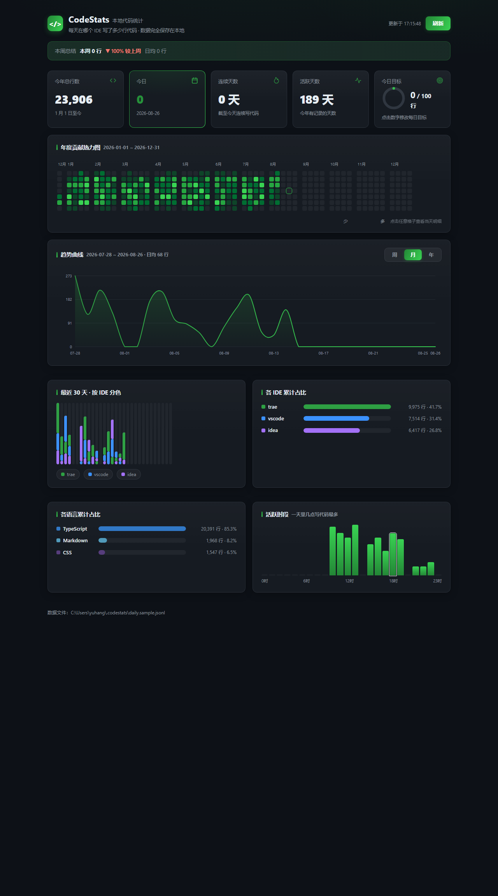

<div align="center">

---

## ✨ 功能特性

|     | 特性               | 说明                                                                         |
| --- | ------------------ | ---------------------------------------------------------------------------- |
| 🟩  | **年度贡献热力图** | GitHub 同款，自然年对齐、按月分隔，**点击任意一天下钻**到当天 IDE / 文件明细 |
| 📈  | **趋势曲线**       | 平滑贝塞尔曲线，**周 / 月 / 年**一键切换，悬停查看每日行数                   |
| 🧩  | **按 IDE 分色**    | trae 绿 / VSCode 蓝 / IntelliJ 紫，一目了然；IDEA 系有独立 Kotlin 插件  |
| 🗣  | **语言统计**       | 按文件扩展名自动聚合（TypeScript / Python / Markdown…）                      |
| 🕐  | **活跃时段**       | 一天 24 小时里几点写代码最多                                                 |
| 🎯  | **每日目标环**     | 设置每日目标行数，进度环 + 达标打勾                                          |
| 📣  | **每周总结**       | 本周行数 + 环比上周（▲ / ▼）                                                 |
| 🖥  | **IDE 侧边栏**     | 不用开浏览器——活动栏点一下，热力图直接嵌在 IDE 左侧                          |
| 🔒  | **全本地存储**     | `~/.codestats/daily.jsonl`，JSONL 追加写入，删文件即清零                     |

## 📸 效果展示



> 上图为样例数据渲染效果。真实数据由扩展实时写入，仪表盘每秒自动刷新。

## 🏗️ 架构

```
┌─ Trae ─┐
├─ VSCode ┴── 同一个 VSCode 系扩展 ─┐
├─ Cursor ─┴───────────────────────┤
└─ Windsurf ─┴─────────────────────┤
                                   ├→ ~/.codestats/daily.jsonl
[IDEA] ──(intellij/ Kotlin 插件)───┘        │  (JSONL 追加写入)
                                            ▼
                           本地仪表盘 (node dashboard/server.js)
                                   │
                                   ├ 🟩 年度热力图 + 点击下钻
                                   ├ 📈 趋势曲线（周/月/年）
                                   ├ 🧩 IDE 分色柱状图
                                   ├ 🗣 语言占比 · 🕐 活跃时段
                                   └ 🎯 目标环 · 📣 周报横幅
```

**关键设计**：Trae、Cursor、Windsurf 都是 VSCode 系 IDE，**一个扩展通吃**，通过 `vscode.env.appName` 自动识别当前 IDE——不需要为每个 IDE 单独写插件。**IDEA 系有独立的 Kotlin 插件**（`intellij/`），数据写入同一份 JSONL，仪表盘自动合并。

## 🚀 快速开始

### 0️⃣ 先看效果（样例数据，1 分钟）

```bash
npm run preview        # 生成 365 天样例数据并启动仪表盘
# 浏览器打开 http://127.0.0.1:4399
```

### 1️⃣ 安装扩展（VSCode / Trae / Cursor / Windsurf）

**方式 A：安装 VSIX（正式）**

`extension/codestats-vscode-0.1.0.vsix` 已打包好：

1. IDE → 扩展面板 → `...` → **从 VSIX 安装…**
2. 选择 `codestats-vscode-0.1.0.vsix`
3. 重启 IDE

**方式 B：F5 调试（开发）**

1. 用 IDE 打开 `extension/` 文件夹
2. 按 `F5`，在弹出的「扩展开发宿主」窗口里写代码

### 1.5️⃣ 安装 IntelliJ IDEA 插件

1. 用 IntelliJ IDEA 打开 **`intellij/`** 文件夹（Gradle 项目，会自动导入）
2. 等依赖同步完（右下角进度条消失）
3. 运行 **`runIde`** Gradle 任务（Gradle 面板双击）→ 会启动一个带插件的测试版 IDEA
4. 在测试版 IDEA 里正常写代码，工具菜单 → **CodeStats: 今日统计** 查看
5. 想装进正式版 IDEA：`.\gradlew.bat buildPlugin` → 生成 `build/distributions/codestats-idea-0.1.0.zip` → 设置 → 插件 → 从磁盘安装

> 首次构建会自动下载 Gradle 和依赖（几百 MB，需联网）；`gradle.properties` 里的 `intellijLocalPath` 指向你本机的 IDEA，删掉则自动下载 IC-2024.1.2 SDK。

### 2️⃣ 日常使用

- 正常写代码，**无需任何操作**，数据自动落盘
- 状态栏显示「今日 +N 行」，点击查看按 IDE 拆分
- 命令面板（Ctrl+Shift+P）：
  - `CodeStats: 今日统计`
  - `CodeStats: 打开仪表盘`（自动启动本地服务器 + 打开热力图）
  - `CodeStats: 打开侧边栏统计`（聚焦 IDE 内的统计侧边栏）

**IDE 侧边栏**：安装后，左侧活动栏会出现一个绿色柱状图图标（CodeStats），点一下就在 IDE 里打开完整仪表盘（热力图 / 曲线 / IDE 语言时段统计），无需开浏览器。数据由扩展直接读取本地 JSONL，不走 HTTP。

### 3️⃣ 看真实数据

```bash
npm start              # 读取 ~/.codestats/daily.jsonl
# 打开 http://127.0.0.1:4399
```

## 🛠️ 技术栈

| 模块   | 技术                                   | 依赖             |
| ------ | -------------------------------------- | ---------------- |
| 扩展   | 纯 JS + VS Code API                    | **零第三方依赖** |
| 仪表盘 | 原生 Node http + 原生 JS + SVG         | **零 npm 包**    |
| 存储   | JSONL 追加写入                         | 无               |
| 图表   | 手写 SVG（平滑曲线 / 堆叠柱 / 进度环） | 无               |

整个项目**没有任何第三方依赖**，`npm start` 就能跑。

## 🧡 许可与安装

- **MIT License**，随便用、随便改
- 扩展本地安装：`extension/codestats-vscode-0.1.0.vsix`（扩展面板 → `...` → 从 VSIX 安装），或打开 `extension/` 文件夹按 F5 调试
- 有问题欢迎提 [Issue](https://github.com/XHang-L/codestats/issues)

## 📄 数据格式

`~/.codestats/daily.jsonl`，每行一条 JSON：

```json
{ "date": "2026-08-14", "ide": "trae", "file": "src/components/Header.tsx", "lines": 42, "ts": 1786600000000 }
```

| 字段    | 说明                                       |
| ------- | ------------------------------------------ |
| `date`  | 本地时区日期（YYYY-MM-DD）                 |
| `ide`   | `trae` / `vscode` / `cursor` / `windsurf`… |
| `file`  | 工作区内相对路径（工作区外为绝对路径）     |
| `lines` | 该文件本次聚合的新增行数                   |
| `ts`    | 落盘时间戳                                 |

**统计口径**：只统计**插入的换行数**——回车、粘贴多行、格式化新增行都会计入；单行内打字、删除不计。这是"新增行数"的简单可靠近似。

## 🧪 测试

```bash
node tools/test-dashboard.js          # 仪表盘 API：35 项（一致性/边界/容错）
node tools/test-extension-logic.js    # 扩展逻辑：30 项（IDE 识别/行数/全链路模拟）
```

覆盖：五路数据交叉求和一致、单日明细、非法日期 400、空数据全 0、脏 JSON 行自动跳过、
全链路「编辑 → 聚合 → 落盘 → 仪表盘解析」格式兼容。

## 📦 目录结构

```
codestats/
├─ extension/              VSCode/Trae 扩展
│  ├─ extension.js         入口（VSCode API 交互 + 侧边栏 Webview）
│  ├─ lib.js               纯逻辑（IDE 识别/行数/记录格式，可单测）
│  ├─ stats.js             聚合统计（浏览器版与侧边栏共用）
│  ├─ webview/             前端（浏览器仪表盘与 IDE 侧边栏共用）
│  │  ├─ index.html
│  │  ├─ app.js            渲染逻辑（热力图/曲线/下钻/目标环…）
│  │  ├─ webview-adapter.js  IDE 内 postMessage 数据桥
│  │  └─ style.css         GitHub 风格（深色 + 绿色系热力图）
│  ├─ media/codestats.svg  活动栏图标
│  └─ codestats-vscode-0.1.0.vsix   安装包
├─ dashboard/
│  └─ server.js            本地服务器（静态服务 + /api/stats + /api/day）
├─ tools/
│  ├─ simulate.js          样例数据生成器
│  ├─ test-dashboard.js    仪表盘自动化测试
│  └─ test-extension-logic.js  扩展逻辑单测
├─ intellij/               IntelliJ IDEA 插件（Kotlin + Gradle，数据同格式）
│  ├─ build.gradle.kts     构建脚本（本地 IDEA SDK 或自动下载）
│  ├─ gradlew.bat          Gradle wrapper
│  └─ src/main/kotlin/...  文档监听 / 聚合 / 落盘 / 菜单命令
└─ package.json            npm start / npm run preview
```

## 🗺️ 路线图

- [x] **IDEA 插件**（Kotlin / JetBrains SDK）—— 基础版已就绪（`intellij/`），待补 WebStorm / PyCharm 适配
- [ ] **Tauri 桌面版**仪表盘（替代网页）
- [ ] **编码时长**（WakaTime 式活跃分钟统计，需扩展升级）
- [ ] **精确活跃时段**（记录每个文件的首个编辑时刻）
- [ ] **云端同步**（多台电脑数据合并）
- [ ] **成就系统**（个人最佳 / 里程碑徽章）

## ⚠️ 已知限制

- IDEA 插件为基础版：统计行数 + 今日明细命令；状态栏小组件、WebStorm/PyCharm 多产品适配待迭代
- 行数 = 插入的换行数，不含单行修改 / 删除
- 日期按本地时区切分（每天从本地 0 点开始）
- `ts` 是落盘时刻而非编辑时刻（活跃时段为近似分布，精确版见路线图）

---

<div align="center">
